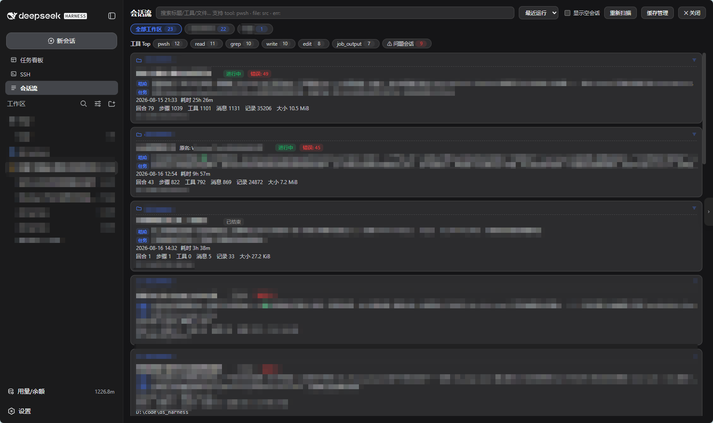
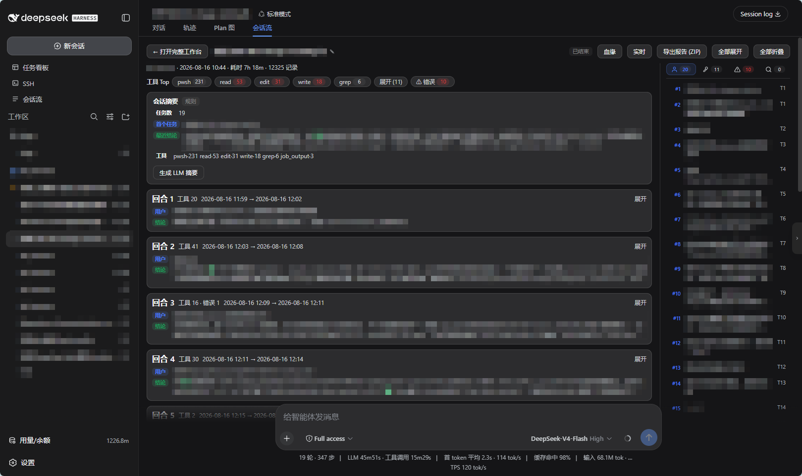
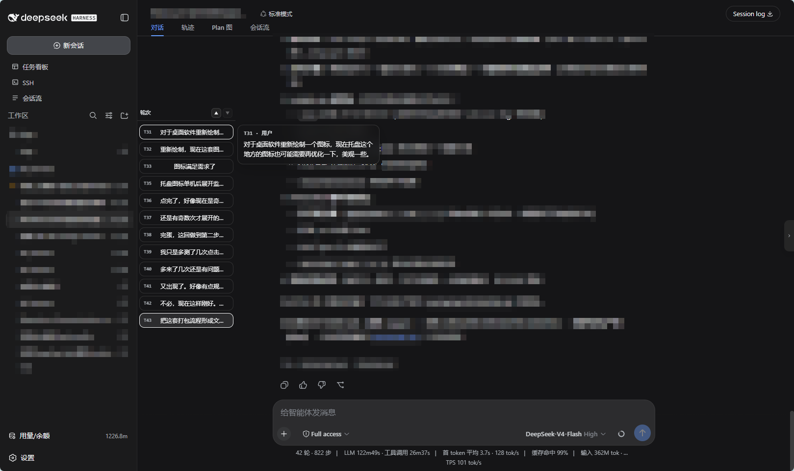
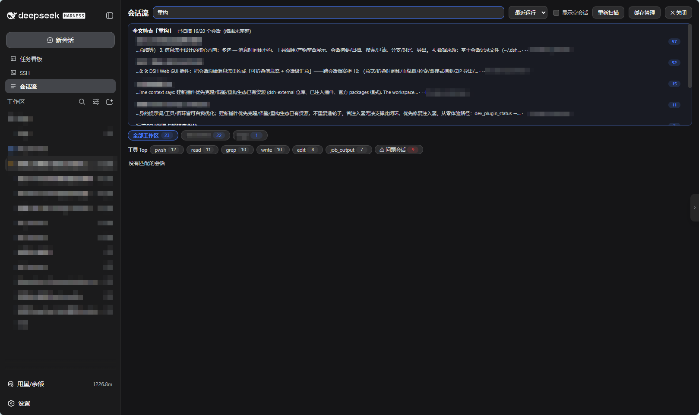
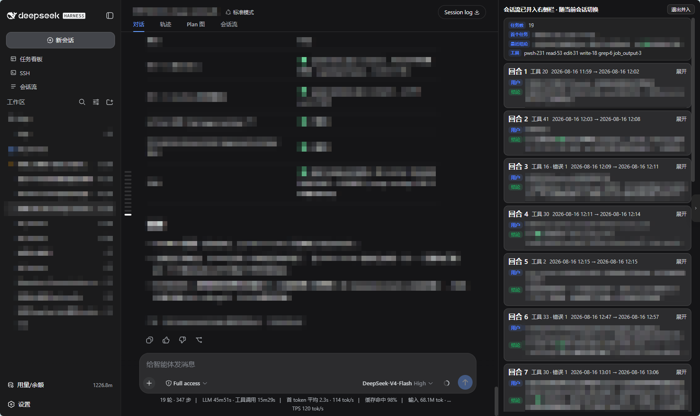
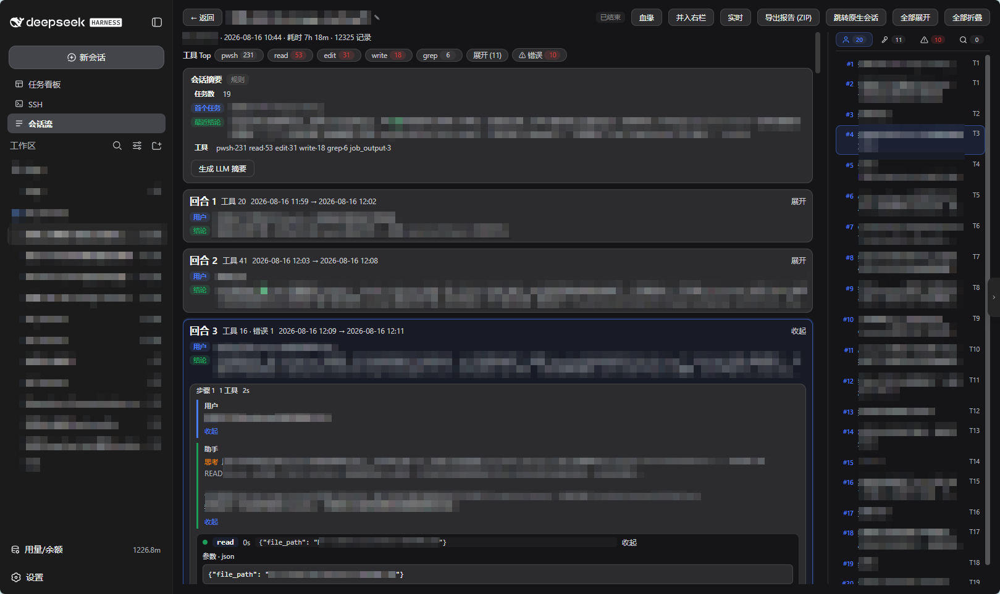

# dsh-session-flow — session review & archive plugin for DSH

> **English** | [中文](README.md)

Restructures DSH session message streams into a **foldable information flow with session-level summaries**: every session becomes an archive card for cross-workspace review, search, and export. The built-in session views (Trajectory / Chat) excel at the microscopic inspection of what is happening right now; this plugin fills the missing layer of **post-hoc review / archival / insight**.

## Interface tour

| Overview workbench | Session Flow tab |
|---|---|
|  |  |
| Session cards with status, conclusion line, first task; hover ✎ to rename inline | "Session Flow" tab embedded in the native conversation page |

| Turn rail | Cross-session full-text search |
|---|---|
|  |  |
| Turn navigation on the left of the Chat tab: collapsed dashes ⇄ expanded cards, one-click jump | Free text in the overview triggers full-text mode: recall across workspaces, hits jump & locate |

| Dock details right | Folded detail view |
|---|---|
|  |  |
| Dock the detail into the official right panel: conversation + flow side by side, drag to resize | Turns folded by default; expand in true chronological order; four-tab navigation |

## Features

| Capability | Description |
|---|---|
| Overview workbench | Session cards (status / errors / duration) + conclusion line; sort, filter, workspace tabs |
| Structured search | `tool:` `file:` `err:` prefixes + free text |
| Folded detail view | Turns collapse to "user message + conclusion"; expand in true chronological order; on-demand loading |
| Four-tab navigation | User messages / tools / errors / search, click to locate & highlight |
| Lineage tree | Subagent derivation tree (offline archive + live runtime channels) |
| Dual-mode summary | Rule summary (zero cost, assembled live) + LLM summary (cached, prompts regeneration) |
| Live tracking | 3s polling for running sessions, breathing highlight + generating indicator |
| ZIP export | Overview + chunked timeline as a Markdown report |
| Session rename | Same data source as the official title (log-backed), synced both ways in real time |
| Health monitor | Four-level classification: active / tool-running / quiet / likely stalled; overview badges + detail live bar |
| Header health chip | Next to the mode label in the session header; a vertical bar that expands into a status card on hover, click to open detail |
| Session Flow tab | Embedded tab on the native conversation page, cross-navigates with the workbench |
| Turn rail | Turn jumps on the left of the Chat tab (Chat tab only) |
| Cross-session full-text search | Content-level recall, hits jump into the Session Flow tab and locate |
| Dock details right | Side-by-side with the main conversation |
| Cache management | View & clean index/timeline caches (never touches DSH data) |

## Install

```sh
# From the plugin market (search dsh-session-flow), or:
dsh plugin add dsh-session-flow
dsh plugin add github:YeqingTang/dsh-session-flow
```

After installing: **restart the DSH Web service** and **hard-refresh the browser** (Ctrl+Shift+R). Success shows the "Session Flow" entry in the sidebar.

Requirements: DSH Web GUI (latest stable); Node.js ≥ 22.19 (built-in zstd decoding, zero third-party dependencies).

## Usage

- **Overview**: sidebar "Session Flow" → all session cards. Search supports `tool:` / `file:` / `err:` prefixes; free text of ≥2 characters additionally triggers cross-session full-text search.
- **Detail**: click a card. Turns are folded by default — click a turn header to expand; the four-tab navigation locates entries; the header offers LLM summary, ZIP export, dock right, and lineage.
- **Native conversation page**: the "Session Flow" tab reviews the current session in place; the turn rail on the Chat tab jumps to any turn; hover the title for ✎ rename (synced with the official title in real time).
- **Health status**: the health chip right of the mode label in the header (vertical bar: green = active / amber = tool running / red = likely stalled) expands on hover; click to open the Session Flow detail. Overview cards and the live bar show the same badges.
- **Live**: click "Live" on a running session, auto-refresh every 3 seconds.

## Acknowledgements

- **[DeepSeek Harness (dsh)](https://github.com/deepseek-ai/deepseek-harness)** — the runtime this plugin builds on.
- **[@deepseek-ai/dsh-session-persistence-jsonl](https://github.com/deepseek-ai/deepseek-harness)** — the zstd multi-frame scanning algorithm (`lib/archive.js` adapted, MIT licensed).
- **[dsh-web-ui (@linxin666 family)](https://github.com/zhu1090093659/dsh-web-ui)** — reference for the sidebar-entry / panel mounting pattern; no code copied.
- **[dsh-webui-market-plugin](https://www.npmjs.com/package/@sanqi-normal/dsh-webui-market-plugin)** — plugin-market mechanism and distribution channel.

Apache-2.0 licensed; original license notices for third-party code are retained.

## License

[Apache-2.0](LICENSE)
